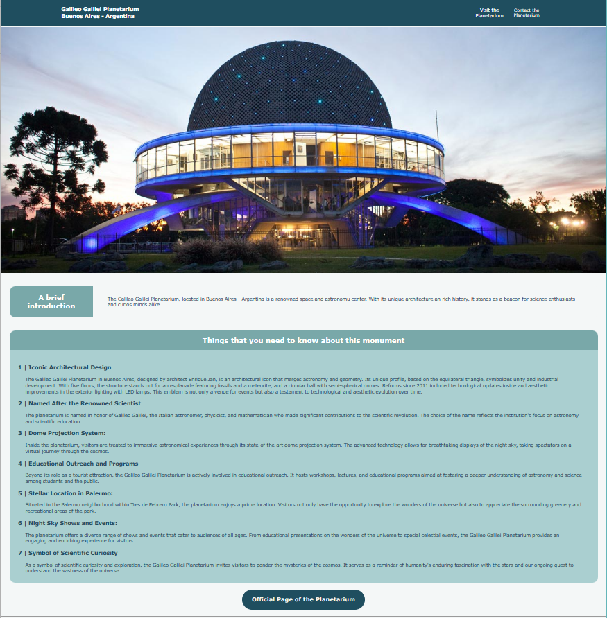

# Galileo Galilei Planetarium

## Tabla de Contenidos

- [Descripción general](#descripción-general)
  - [Screenshot](#screenshot)
  - [Links](#links)
- [Creado con](#creado-con)

## Descripción general
Este proyecto es una página web informativa sobre al Planetario Galileo Galilei. 

### Screenshot

  

    
  

### Links
- Repository URL: [https://github.com/nazasosaro/basic-webpage/tree/main]
- Galileo Galilei Planetarium URL: [https://galileogalileiplanetarium.netlify.app/]

## Creado con
### Frontend
- HTML
- CSS
- JavaScript
